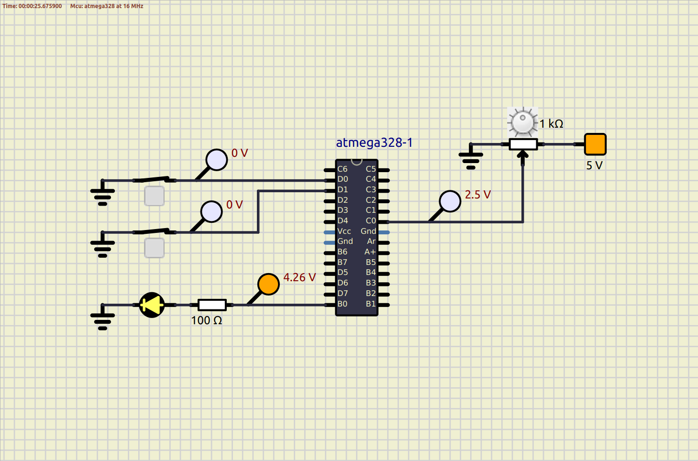
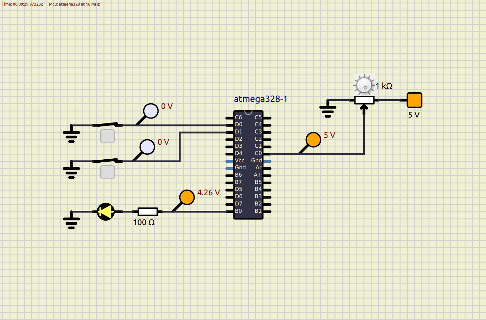

# lnt-emb-c-activities

This project is part of LnT STEPin program. The objective is to learn Embedded C programming.

For simulation, [SimulIDE](https://www.simulide.com/p/home.html) is used.

# Overview
Objective is to make a Car Seat Heater. The whole project is divided into four different activities.

## Activity 1
* Show status of the heater (ON or OFF) using an LED on the car dashboard.
* Heater can be turned ON or OFF using a switch only if the seat is occupied.
* Occupancy of the seat is known by a sensor.

### In Action
* `DASHBOARD_LED`
    * Show heater status.
    * Connected to `B0`.
* `HEATER_SWITCH`
    * Switch to turn heater ON or OFF.
    * Connected to `D0`.
* `BUTTON_SENSOR`
    * Sensor (emulated as switch) to sense seat occupancy.
    * Connected to `D1`.

| Case 00                            | Case 01                            |
|------------------------------------|------------------------------------|
|  |  |

| Case 10                            | Case 11                            |
|------------------------------------|------------------------------------|
|  |  |

## Activity 2
* Read temperature from a temperature sensor (analog).

### In Action
* `TEMPERATURE_SENSOR`
    * Sensor (emulated as potentiometer) to sense temperature.
    * Give analog signal (voltage from 0V to 5V) for sensed temperature.
    * Connected to `C0`.

| Test Case                         | Output              | Expected Output |
|-----------------------------------|---------------------|-----------------|
|  | (0000000000) 0V     | 0V              |
|  | (0111111111) 2.495V | 2.5V            |
|  | (1111111110) 4.990V | 5V              |