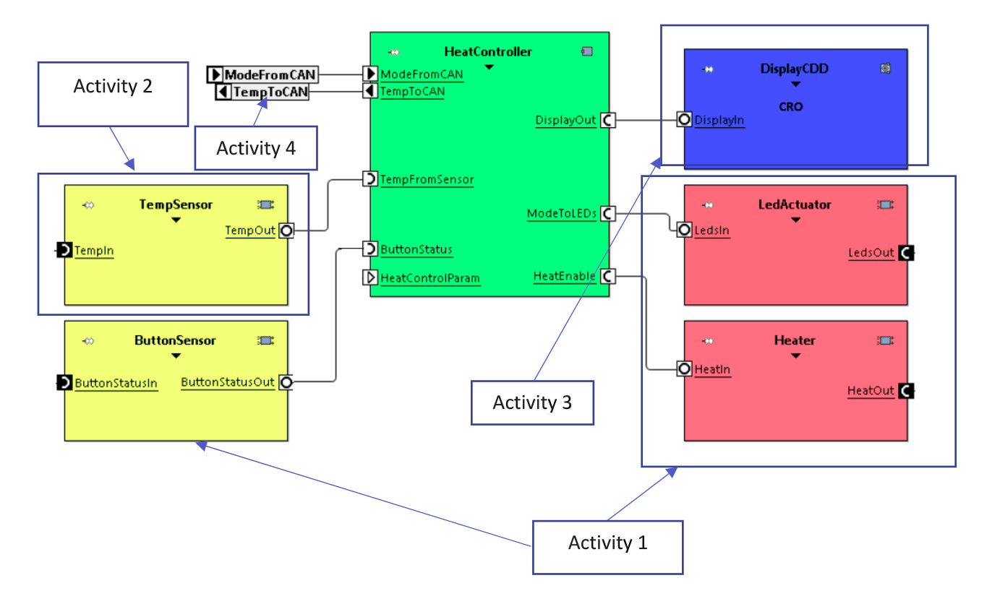
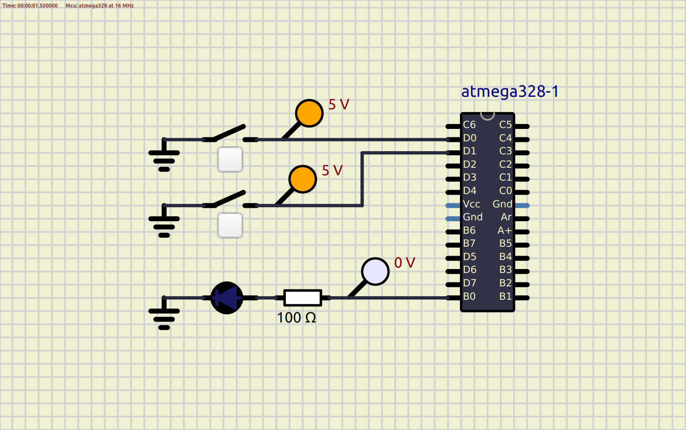
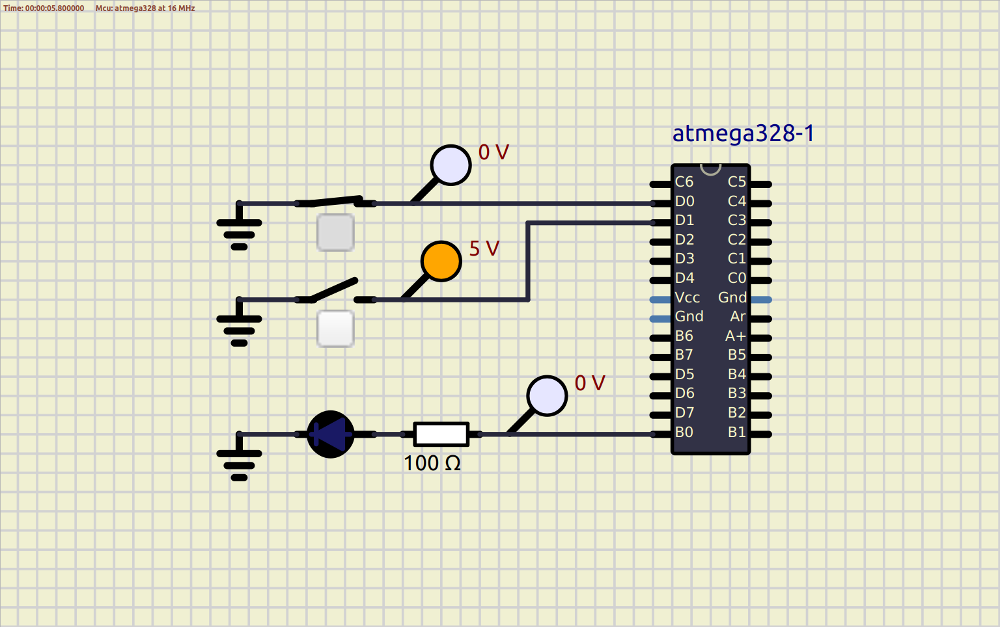
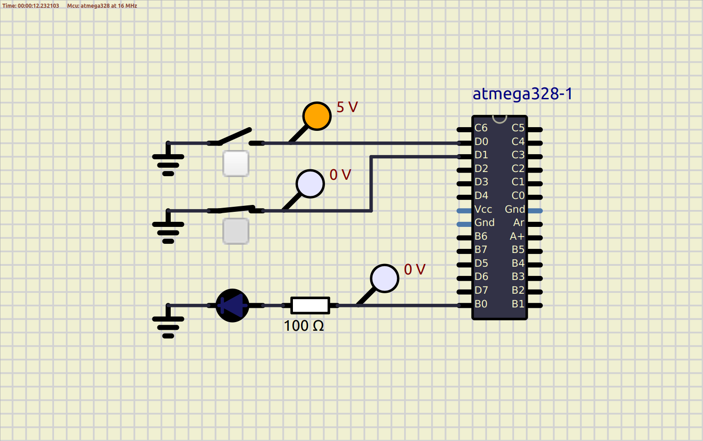
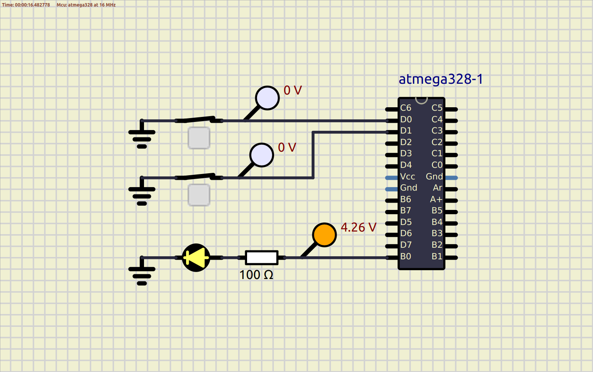

# lnt-emb-c-activities

This project is part of LnT STEPin program. The objective is to learn Embedded C programming.

For simulation, [SimulIDE](https://www.simulide.com/p/home.html) is used.

# Overview
Objective is to make a Car Seat Heater. The whole project is divided into four different activities.

## Activity 1
* Show status of the heater using an LED on the car dashboard.
* Heater can be toggled ON or OFF using a Push Button only if the seat is occupied.
* Occupancy of the seat is evaluated by the state of a switch.

### In Action
| Case 00                            | Case 01                            |
|------------------------------------|------------------------------------|
|  |  |

| Case 10                            | Case 11                            |
|------------------------------------|------------------------------------|
|  |  |